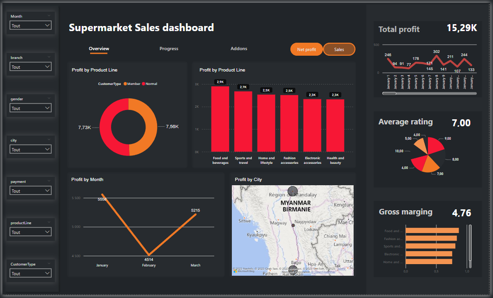
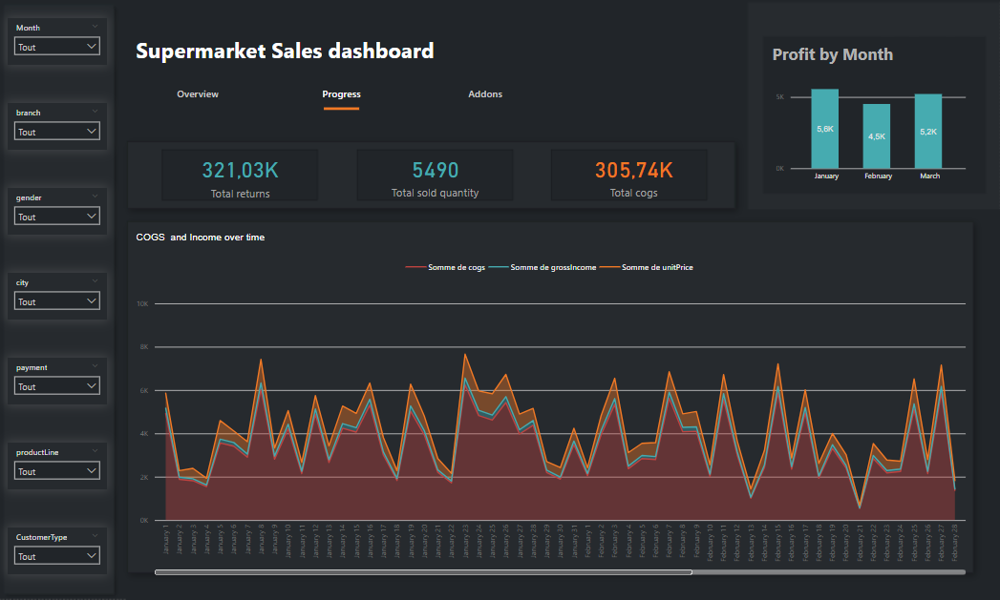
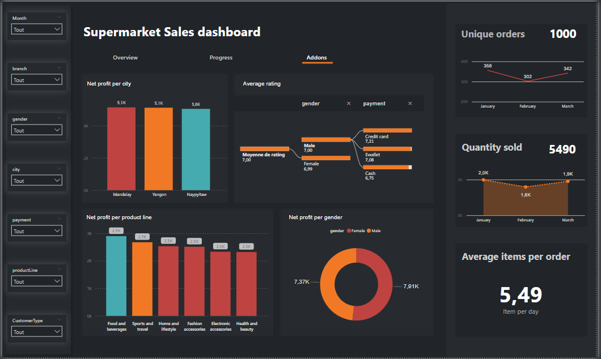

# TV Sales Data Visualization Using Power BI

[Project Description]
This repository contains the Power BI dashboard for visualizing TV sales data. The dashboard is built on top of the data generated and integrated through the [Supermarket Sales Data Integration ETL project using Talend](https://github.com/SAAD-BEN/Tvs_Sales_Data_Integration_ETL_Using_Talend).

## Table of Contents

- [Dashboard Overview](#dashboard-overview)
- [Screenshots](#screenshots)
- [Accessing the Dashboard](#accessing-the-dashboard)
- [Usage](#usage)

## Dashboard Overview

Our Power BI dashboard is designed to provide valuable insights and visualizations based on the integrated TV sales data. It offers an interactive and user-friendly interface for exploring key metrics and trends in the sales data. This dashboard serves as the visual interface to the data integration process, offering a clear perspective on the results of our ETL efforts.

## Screenshots
### Overview

### Progress

### AddOns

## Accessing the Dashboard

To access and use the Power BI dashboard, follow these steps:

1. **Download Power BI Desktop:** If you don't have Power BI Desktop installed, you can download it [here](https://powerbi.microsoft.com/en-us/desktop/).

2. **Clone or Download this Repository:** You can clone this repository to your local machine using Git, or you can simply download it as a ZIP file.

3. **Open the Dashboard in Power BI Desktop:**
   - Launch Power BI Desktop.
   - Open the Power BI file named `TV_Sales_Dashboard.pbix` located in the repository.

4. **Connect to the Data:**
   - Upon opening the dashboard, The data is already loaded using the import data connection type, so no additional connection is needed.

5. **Explore the Dashboard:**
   - You can explore the various visualizations, filters, and insights provided by the dashboard, which reflect the outcomes of our data integration process.

## Usage

The dashboard is structured as follows:

- **Overview Page:** The main Overview page provides a comprehensive overview of key performance indicators. It includes two sub-pages: one based on profit and the other on the quantity sold. You can navigate between these sub-pages using the orange button in the top right corner.

- **Progress Page:** The Progress page contains visualizations that depict progress over time, enabling you to track trends and changes in the data.

- **Filters:** All dashboard pages include a list of filters on the left side, allowing you to interactively explore data based on different dimensions.

